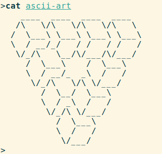
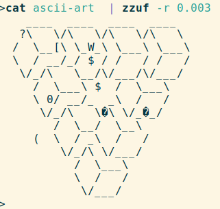
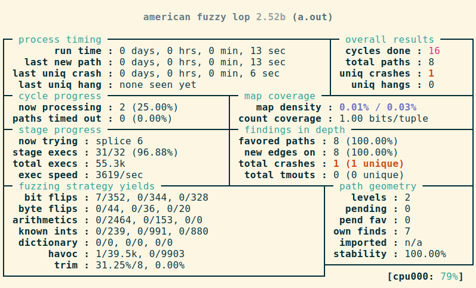

# Fuzzing - Ein kurzer Überblick
_28.01.2019_

# Inhaltsverzeichnis


1. [Grundidee](#grundidee)
2. [Techniken](#techniken)
   1. [Zufälliges Fuzzing (random fuzzing)](#zufälliges-fuzzing-random-fuzzing)
   2. [Mutationsbasiertes Fuzzing (mutation based fuzzing)](#mutationsbasiertes-fuzzing-mutation-based-fuzzing)
   3. [Regelbasiertes Fuzzing (generation based fuzzing)](#regelbasiertes-fuzzing-generation-based-fuzzing)
   4. [Instrumentiertes Fuzzing (coverage guided fuzzing)](#instrumentiertes-fuzzing-coverage-guided-fuzzing)
   5. [Datenmutation](#datenmutation)
   6. [Sanitizer](#sanitizer)
3. [Praktische Hinweise](#praktische-hinweise)
4. [Tools](#tools)
   1. [AFL und libFuzzer](#afl-und-libfuzzer)
   2. [Kernel Fuzzer](#kernel-fuzzer)
   3. [Weitere Tools](#weitere-tools)
5. [Fazit](#fazit)
6. [Anhang](#anhang)
   1. [Schnelleinführung AFL](#schnelleinführung-afl)
   2. [Schnelleinführung libFuzzer](#schnelleinführung-libfuzzer)
7. [Literatur](#literatur)


# Grundidee
Fuzzing ist eine Methode aus dem Software- bzw. Hardwaretesting und ist seit den 1980er Jahren bekannt und seitdem immer weiter erforscht und verbessert.
Die Grundidee ist sehr simpel und besteht im Wesentlichen aus zwei Schritten:

1. ein System mit zufälligen Daten starten
2. jeden Systemabsturz und dessen Ursache protokollieren

Diese beiden Schritten werden dann sehr oft ausgeführt, mehrere tausend bis Millionen Male.

Durch das simple Prinzip ist eine Implementierung sehr einfach und für neue Systeme ohne bestehende Fuzzing-Software lassen sich sehr schnell einfache Fuzzing-Tests schreiben. Da im Gegensatz zu Unit Tests die Testfälle nicht manuell geschrieben werden müssen und damit von der Geschwindigkeit und Kreativität eines Menschen abhängen, werden relativ einfach auch Fehler bei Randfällen und Szenarien außerhalb der Spezifikation gefunden. Zusätzlich ist der Wartungsaufwand gering: beim initialen Aufsetzen muss man keine Testfälle spezifizieren, sondern nur das Fuzzing-System. Danach werden ohne weiteren manuellen Aufwand die Tests durchlaufen. Bei System- und Schnittstellenänderungen müssen die Testfallspezifikationen nicht angepasst werden.

Nachteilig ist die Einschränkung von Fuzzing, dass nur die Robustheit getestet wird. Es wird nur überprüft ob das Programm abstürzt oder sich aufhängt, eine Verifikation der Ergebnisse findet nicht statt. Außerdem ist der Rechenaufwand hoch, so muss man bei komplexeren Systemen, die sich nicht isolieren lassen und große Eingabedaten benötigen sehr viele Tests ausführen und entweder tage- bzw. wochenlang fuzzen oder statt einem Rechner dutzende oder hunderte verwenden. So verwendet Google für das Fuzzing von Chrome tausende CPU-Kerne.


# Techniken
Grundsätzlich lassen sich zwei Aspekte unterscheiden: zum einen welches System gefuzzt wird und zum anderen wie die Daten generiert werden. In diesem Zusammenhang kann System für mehrere Sachen stehen: für Programme, Betriebssysteme oder Hardware. 

Die Datengenerierung kann durch mehrere Methoden geschehen: zufälliges Fuzzing, mutationsbasiertes Fuzzing, regelbasiertes Fuzzing sowie instrumentiertes Fuzzing. Wie die generierten Daten an das gefuzzte System kommen, ist lediglich eine Frage, welche Schnittstellen das System zur Verfügung stellt. Bei  Programmen können dies beispielsweise Dateien, die Standardeingabe `stdin` unter Linux oder Netzwerkschnittstellen bei Serverprogrammen sein. Betriebssysteme werden über ihre spezifischen Schnittstellen wie `syscalls` oder `ioctl` angesprochen. Genauso gut kann man Hardwaregeräte wie USB-Geräte emulieren, sodass diese Daten an das Betriebssystem und dessen Treiber senden. Hardware kann zum einen über das Ändern der elektrischen Signale gefuzzt werden oder bei Prozessoren über die Maschinenbefehle. 

Ich lege den Fokus im weiteren Text auf Software und gehe auf ein paar Besonderheiten dabei ein. Die grundsätzlichen Methoden lassen sich dabei aber auf Hardware- und alle anderen Systeme übertragen.


## Zufälliges Fuzzing  (random fuzzing)
Bei zufälligen Fuzzing werden, wie schon der Name andeutet, rein zufällige Daten an das System geschickt. Diese Methode ist sehr einfach und simpel zu implementieren (in Linux beispielsweise `cat /dev/urandom |  programm_to_fuzz`), aber nicht sehr effizient. So reichen schon einfachste Validierungen der Eingangsdaten, um diese als fehlerhaft zu erkennen. Da das System in diesem Fall die Verarbeitung beendet, werden nur kleine Teile des Programms getestet.

## Mutationsbasiertes Fuzzing (mutation based fuzzing)
Eine deutlich effizientere Testmöglichkeit bietet das mutationsbasierte Fuzzing (engl. mutation-based fuzzing). Dabei wir zuerst eine Sammlung von Testdaten angelegt, Testkorpus genannt. Diese werden dann zufällig verändert (mutiert) und in das Programm gespeist. Diese Methode ist sehr einfach zu implementieren und effizient im Fehler finden. Da noch ein großer Teil der Daten valide ist, im Gegensatz zum zufälligen Fuzzing, werden die Daten angefangen zu verarbeiten. Simple Validierungen und Datenüberprüfungen erkennen die Daten als korrekt an.

Ein Nachteil dieser Methode ist die große Abhängigkeit von der Testdatenauswahl. Für eine möglichst hohe Testabdeckung müssen viele Programmzweige durchlaufen werden. Dies geschieht aber nur, falls die Testdaten geeignet dafür sind und möglichst viele Fälle abdecken. Beispielsweise sollte man um einen PDF-Reader zu testen nicht nur simple PDF-Dateien mit Text verwenden, sondern es sollten auch Bilder, Videos, eingebettete Schriftarten und komplizierte Layouts verwendet werden. 

* Tools: [`zzuf`](http://caca.zoy.org/wiki/zzuf), [`Radamsa`](https://gitlab.com/akihe/radamsa)
 
## Regelbasiertes Fuzzing (generation based fuzzing)
Eine ähnliche Methode ist das das regelbasierte Fuzzing (engl. generation based fuzzing). Dabei wird auf Grundlage dieser Spezifikation eine Beschreibung der Daten generiert, beispielsweise eine Grammatik oder ein Protokoll, und daraus werden Sequenzen generiert. Diese generierten Sequenzen lassen sich dann wieder zufällig mutieren. Zusätzlich lassen sich aber auch komplette Nachrichten der Kommunikation wiederholen oder weglassen. Dies hat den Vorteil einer einfachen Entdeckung auch komplexer Logik- und Protokollfehler, wenn beispielsweise die interne Zustandsautomat fehlerhafte Übergange hat. Außerdem können alle möglichen Fälle der Spezifikation getestet werden, wordurch der Test sehr gründlich erfolgt.

Durch die Notwendigkeit der Beschreibung ist der anfängliche Aufwand sehr hoch, diese Beschreibung muss zuerst erstellt werden. Außerdem müssen überhaupt die Daten wohlgeformt sein und einer Spezifikation genügen. Zusätzlich ist dann der Erfolg des Fuzzing stark abhängig von der Güte der Beschreibung, ob diese alle Aspekte modeliert oder nicht.

* Tools: [`Peach Fuzzer`](https://www.peach.tech/products/peach-fuzzer/), [`Dharma`](https://github.com/MozillaSecurity/dharma/)
  
## Instrumentiertes Fuzzing (coverage guided fuzzing)
Die neuste Entwicklung ist das instrumentierte Fuzzing (engl. coverage guided fuzzing). Dabei wird für alle Eingangsdaten die Codeausführung beobachten und mit diesem Feedback die Eingangsdaten verändert, sodass möglichst viele Codezweige erreicht werden. Wenn beispielsweise durch Mutation eines bestimmten Bytes keinen neuen  Codezweige erreicht werden, wird die Mutation abgebrochen und durch Mutation anderer Bytes versucht, einen neuen Codezweig zu erreichen. Typischerweise ist auch hier Ausgangspunkt ein Korpus an Testdaten, die mutiert werden.

Diese Methode setzt natürlich voraus, dass man die Codeausführung beobachten kann. Wenn der Quellcode verfügbar ist, wird dies meist durch spezielle eingefügte Instruktionen erreicht. Natürlich ist auch die Verwendung eines Debuggers möglich. Der generelle Vorteil ist eine hohe Effizienz, da nur Bytes verändert werden, die einen Einfluss auf den Programmablauf haben. Dadurch wird außerdem eine hohe Code-Abdeckung erreicht. Nachteil ist eine geringere Performance, entweder durch die zusätzlichen Instruktionen oder durch den Debugger. Dieser Performancenachteil darf dabei nicht größer werden als die verbesserte Effizienz, da sonst die Gesamtzahl an gefunden Fehlern im Programm sinkt.

Ein weiterer Vorteil ist die Möglichkeit der Testkorpus- und Testfallminimierung. Bei der Minimierung des Testkorpus werden alle Testdaten zusammengefasst, bei deren Verarbeitung die gleichen Codezweige durchlaufen werden. Die Testfallminimierung verringert die Größe der einzelnen Testdaten, sodass eine möglichst kleiner Datensatz erzeugt wird, bei dessen Verarbeitung trotzdem diesselben Codepfade durchlaufen werden wie beim ursprünglichen, großen Datensatz. Beide Methoden führen zu einer höheren Performance und Effizienz bei den nächsten Fuzzing-Tests. Außerdem ermöglicht die Testfallminimierung ein vereinfachtes Finden des zugrundeliegenden Fehlers im Code.

* Tools: [`AFL`](http://lcamtuf.coredump.cx/afl/), [`libFuzzer`](https://llvm.org/docs/LibFuzzer.html), [`honggfuzz`](https://github.com/google/honggfuzz)


)")


Die Mächtigkeit des instrumentierten Fuzzing zeigt sich an einem Beispiel. Für das Fuzzing einer Bildbibliothek wurde als einziger Testfall eine Textdatei mit dem Inhalt `hello` genommen. Wenn dann das Fuzzing begonnen wird, werden nach und nach die Bytes so verändert, dass neue Codezweige erreicht werden. Dadurch werden nach und nach die Strukturen des Bildformates erstellt. Nach einiger Zeit des Fuzzens wird dann sogar ein komplettes valides Bild erzeugt. Eine Auswahl erzeugter Bilder ist in Abbildung 1 abgebildet.


## Datenmutation
Das vollständige Verändern aller Bytes mit allen Möglichkeiten ist nicht machbar. So gibt es bei einem 32-Bit Wert 2^32 Möglichkeiten, was viele Tage dauern würde zu fuzzen. Aus diesem Grund muss man den Suchraum einschränken. So werden die Bits nur geflippt oder verschoben und bei Zahlen Werte dazu addiert und subtrahiert. Außerdem kann man die Zahlen und Zeichenketten durch interessante Werte ersetzen, beispielsweise 0, 1, -1, die maximale und minimale Zahl des Zahlenbereichs, bei Gleitkommazahlen die speziellen Werte `NaN` oder `-Inf` und um Speicherfehler zu erkennen typische Buffergrößen wie 16, 32 oder 128. Interessante Zeichenketten sind beispielsweise komplett leere oder sehr lange Zeichenketten (`''`, `128*'a'`), spezielle Bytes und Zeichen wie `\0` als Ende von Zeichenketten in C oder `\n` als Zeilenumbruch oder Formatierungsbefehle wie `s%s%s%s` oder `%x %x %x` für die Funktion `printf`, die Format String-Angriffe ermöglichen.


Demonstriert werden kann diese Datenmanipulation am Beispiel des Tools `zzuf`, welches zufällige Bit-Flips und Byte-Ersetzungen durchführt. 


| Ausgangstext   | Mutierter Text    | 
| -------------- | ----------------- |
|  |  |
| | |

Eine bessere Technik verwendet das Tool `radamsa`, welches bei der Datenmutation erkennt, ob es sich um Zahlen oder Zeichenketten handelt. Dementsprechend werden dann die Daten manipuliert. 


```console
$ echo Fuzzing 123 abc | radamsa -n 13
F󠁟uzzing 170141183460469231731687303715884105728 abc
Fuzzing 128�0aaaaaaaaaaaaaa252823118408938500307192722993203201 abc
Fuzzing 1 abc
Fuzzing 12󠁥3 abc
Fuzzing ---2215115693669076737 abc
Fʲʠ�� 󠁀 ab��� abc
Fuzzing 4294976518���170141183460469231731687303715884105727 abc
Fuzzang 0;xcalc\x0a\n%d'xcalc;xcalcaaaa%d%n$(xcalc)$!!;xcalc%n-316 abc
Fuzzing 0 abc
Fuzzing 2147483648 abc
Fuzzing 2147483526 abc
Fuzzing -88442 abc 
Fuzzing 340282366920938463463374607431768211455 abc
$  
```


## Sanitizer
Bestimmte Fehler in Programmen führen nicht oder nicht sofort zu einem Absturz. So kann ein Speicherfehler durch einen fehlerhaften Schreibvorgang erst nach vielen anderen Befehlen zu einem Absturz führen. Oder es wird nur ein sehr kleiner Teil des Speichers beschädigt, sodass nur unter sehr speziellen Umständen das Programm abstürzt. 

Eine Lösung für dieses Problem ist die Verwendung eines Sanitizers. Dieser fügt beim Kompilieren zusätzliche Instruktionen ein, um die Befehle zur Laufzeit zu prüfen. Beispielsweise kann vor jedem Speicherzugriff eine Überprüfung erfolgen, ob tatsächlich auf diesen Speicher zugegriffen werden darf. Ein Nachteil ist die verringerte Performance und der erhöhte Speicherbedarf, die sich beide um den Faktor zwei oder noch stärker verschlechtern können. Da aber beim Fuzzing mit aktivierten Sanitizer deutlich mehr Fehler gefunden werden können, ist es trotzdem sinnvoll Sanitizer zu verwenden.

Es wurden verschiedene Sanitizer entwickelt, diese sind aber teilweise nicht für alle Compiler verfügbar. In der folgenden Tabelle ist eine Übersicht über die verschiedenen Sanitizer, deren erkannten Fehlerklassen und welche Compiler diese unterstützen. 


| Sanitizer   | Fehlerklassen    | Compiler    |
| ----------- | ---------------- | ----------- |
| [Address Sanitizer (ASan)](https://github.com/google/sanitizers/wiki/AddressSanitizer) | Out-of-bounds accesses, Use-after-free, Use-after-return, Use-after-scope, Double-free, invalid free | gcc, clang |
| [Undefined Behavior Sanitizer (UBSan)](https://clang.llvm.org/docs/UndefinedBehaviorSanitizer.html)| Using misaligned or null pointer, igned integer overflow, overflowing conversions with floating-point types | gcc, clang |
| [Memory Sanitizer (MSan)](https://github.com/google/sanitizers/wiki/MemorySanitizer) | Lesen von uninitialisiertem Speicher | clang |
| Leak Sanitizer | Memory leaks | gcc, clang |
| Thread Sanitizer (TSan) | Data races | gcc, clang |
    
  
### Demonstration Address Sanitizers

Um die Funktion von Address Sanitizern zu zeigen, ist im folgende ein Beispielprogramm gegeben. Es liest eine Zeichenkette aus der Standardeingabe `stdin` und kopiert diese in einen 16 Byte großen Buffer. Da keine Überprüfung der Länge der Eingabe erfolgt, werden auch Zeichenketten länger als 16 Bytes in den Buffer kopiert. Dies führt zu einem Buffer Overflow: 

```c
#include <stdio.h>
#include <stdlib.h>
#include <string.h>
#include <sys/types.h>
void func(char **argv) {
  printf("running strcpy...\n");
  char arr[16];
  strcpy(arr, argv[1]);
}
int main(int argc, char *argv[]) {
  if(argc == 2) {
    func(argv);
  }
  return(0);
}
```

Wenn dieses Programm kompiliert und ausgeführt wird, kommt es bei einem Buffer Overflow nicht sofort zum Absturz. Beim Kopieren der Eingabedaten werden einfach die Daten hinter dem Buffer überschrieben, diese sind aber nicht sofort für den Programmablauf relevant. Erst bei einer deutliche längeren Zeichenkette kommt es zu einer Beschädigung des Speichers, sodass das Programm abstürzt.

```console
$ gcc -o buffer_overflow buffer_overflow.c
$ ./buffer_overflow aaaaaaaaaaaaaaa # 15*a
running strcpy...
$ ./buffer_overflow aaaaaaaaaaaaaaaa # 16*a, buffer overflowing
running strcpy...
$ ./buffer_overflow aaaaaaaaaaaaaaaaaaaaaaaaa # 25*a, buffer overflow
running strcpy...
*** stack smashing detected ***: <unknown> terminated
```

Sobald das Programm mit dem Address Sanitizer kompiliert wird, wird sofort bei einem Buffer Overflow und Überschreiten der zulässigen Zeichenlänge ein Fehler ausgegeben und die Programmausführung stoppt.

```console
$ gcc -o buffer_overflow -fsanitize=address buffer_overflow.c
$ ./buffer_overflow aaaaaaaaaaaaaaa # 15*a
running strcpy...
$ ./buffer_overflow aaaaaaaaaaaaaaaa # 16*a, buffer overflowing
running strcpy...
=================================================================
==24698==ERROR: AddressSanitizer: stack-buffer-overflow on
address 0x7fff58d871a0 at pc 0x7face647d741 bp 0x7fff58d87150
sp 0x7fff58d868f8
```


# Praktische Hinweise
In der Praxis muss immer zwischen Fuzzing-Geschwindigkeit und Fuzzing-Effizienz abgewogen werden. Zum Ziel einer möglichst großen Anzahl an gefundenen Fehlern, muss das Programm möglichst oft mit unterschiedlichen Daten ausgeführt werden. Gleichzeitig müssen die unterschiedlichen Daten möglichst oft zu einem fehlerhaften Programmverhalten führen. So ist unter Umständen ein dummer, aber dafür schneller Fuzzer besser als ein sehr intelligenter, dafür aber langsamer Fuzzer. 

Des weiteren sollte man immer Sanitizer verwenden, falls der Quellcode zur Verfügung steht. Dadurch können deutlich mehr Fehler gefunden werden. So wurde beispielsweise beim Kompilieren und darauffolgenden Benutzen eines kompletten Gentoo-Linux-Systems  mit aktivierten Address Sanitizer Fehler in fast allen verwendeten Programmen gefunden, u.a. in bash, man-db, screen, claws-mail, dovecot, glib, Gnome, QT, KDE, libarchive und lvm2 [[Böck, Hanno. Improving security with Fuzzing and Sanitizers. Konferenzvortrag SHA 2017](https://media.ccc.de/v/SHA2017-148-improving_security_with_fuzzing_and_sanitizers#t=593)].

Die Verwendung von Prüfsummen oder kryptografische Signaturen erschwert Fuzzing. So werden beim Mutieren der Daten die Prüfsummen ungültig, das Programm überprüft und erkennt die ungültigen Daten und bricht die Verarbeitung ab. Daher sollten solche Elemente entweder im Quellcode deaktiviert werden oder die mutierten Daten müssen eine Nachverarbeitungsschritt durchlaufen, bei dem die Checksumme für die mutierten Daten neu berechnet wird.


# Tools
## AFL und libFuzzer
Zwei sehr populäre Fuzzing-Tools sind der von Michal Zalewski entwickelte Fuzzer american fuzzy lob, kurz [AFL](http://lcamtuf.coredump.cx/afl/), sowie der von der LLVM-Community gepflegte [libFuzzer](http://llvm.org/docs/LibFuzzer.html). Beide erreichen durch das instrumentieren des Codes eine hohe Effizienz sowie Code-Abdeckung. Mit beiden wurden hunderte Fehler gefunden und die Heartbleed getaufte Lücke in der OpenSSL-Bibliothek hätte durch Fuzzing in Verbindung mit Sanitizern gefunden werden können [[Böck, Hanno, 2015. How Heartbleed could've been found](https://blog.hboeck.de/archives/868-How-Heartbleed-couldve-been-found.html)]. 

AFL und libFuzzer unterscheiden sich in mehreren Details: AFL ermöglicht einen sehr schnellen und simplen Einstieg, nach wenigen Minuten kann man einen ersten Fuzzing-Durchlauf starten. So werden die Dateien im  Testkorpus per `stdin` oder als Dateiname  an das Programm übergeben. Standardmäßig kompiliert man das Programm neu mit eingefügten Instrumentationsbefehlen. Alternativ kann man ein vorhandenes Binary zur Laufzeit mit diesen Befehlen versehen und dadurch ein Feedback der Programmausführung erhalten, diese Methode ist aber typischerweise zwei- bis fünfmal langsamer. In der Grundkonfiguration wird für jeden einzelnen Programmdurchlauf ein neuer Prozess gestartet, durch Anpassungen des Codes ist aber auch In-Prozess-Fuzzing möglich. Dabei wird kein neuer Prozess erzeugt, sondern die Daten direkt im Speicher verändert.

Zum initialen Aufsetzen von libFuzzer benötigt man etwas mehr Zeit, da man zuerst ein kleines Helferprogramm schreiben und kompilieren muss, welche die generierten Daten des Fuzzers annimmt, ggf. korrekt formatiert und das Programm damit aufruft. Die Kompilation muss dabei mit dem Compiler `clang` erfolgen. Da standardmäßig In-Prozess-Fuzzing ausgeführt wird, ist die Fuzzinggeschwindigkeit höher im Vergleich zu AFL.

Im [Anhang](#anhang) sind für beide Tools Schnelleinführungen gegeben, die ein einfaches Ausprobieren ermöglichen.

## Kernel Fuzzer
Da weder AFL noch libFuzzer das Fuzzing von Kerneln erlauben, wurde andere Tools entwickelt, um  dieses durchzuführen. So ist für Linux-Kernel-Fuzzing [`trinity` ](https://github.com/kernelslacker/trinity) weit verbreitet, welches Syscalls sowie ioctls fuzzt. Dabei werden keine komplett zufälligen Daten verwendet, sondern die jeweils richtigen Datentypen übergeben, beispielsweise Pointer, Adressen oder Dateihandler. 

Daneben gibt es das von Google entwickelte Tool [`syzkaller`](https://githu.com/google/syzkaller), welches im Gegensatz zu trinity instrumentiertes Kernel-Fuzzing ermöglicht. Verschiedene Kernel werden unterstützt, neben Linux- unter anderem auch FreeBSD, NetBSD und Windows-Kernel, mit jeweils unterschiedlich guter Unterstützung.

Da durch Betriebssystem-Fuzzing potenziell ungewollte Seiteneffekte wie das Löschen von Dateien auftreten können, sollte es nicht auf einem Produktivsystem durchgeführt werden. Syzkaller verwendet dazu standardmäßig virtuelle Maschinen (mittels `qemu`). Außerdem sollten aus diesem Grund keine Netzlaufwerke eingebunden sein. Zusätzlich sollten die Rechner nicht mit dem Internet verbunden sein, da invalide Pakete an zufällige IP-Addressen gesendet werden können, wodurch diese abstürzen könnten.

Der Linux-Kernel unterstützt Sanitizer, darum sollte sowohl mit dem [Kernel Address Sanitizer (KASAN)](https://www.kernel.org/doc/html/latest/dev-tools/kasan.html) als auch mit dem [Undefined Behavior Sanitizer (UBSAN)](https://www.kernel.org/doc/html/latest/dev-tools/ubsan.html) gefuzzt werden.


  
## Weitere Tools
Um die Prozessor- bzw. CPU-Instruktionen zu überprüfen, wurde das Tool [`Sandsifter`](https://github.com/rigred/sandsifter) entwickelt, welches auf x86-CPUs zufällige Instruktionen ausführt. Zum einen wurden dadurch Fehler in Disassemblern, Emulatoren und einem Hypervisor gefunden, mit denen der erzeugte Maschinencode analysiert wurde. Zum anderen wurden zusätzlich undokumentierte Prozessorfunktionen und -befehle gefunden sowie die fehlerhafte Ausführung von verschiedenen Maschinenbefehlen aufgedeckt.  

# Fazit
Zusammenfassend ist Fuzzing eine bedeutsame Technik, um die Qualität von Software sicherzustellen. So lassen sich vor allem bei den ersten Fuzzing-Tests auf Code viele Fehler finden, die Stabilität und Sicherheit beeinträchtigen. Zusätzlich ist die Einrichtung automatischer Tests und deren Integration in eine Continuous-Integration-Pipeline nicht schwierig, wodurch eine gleichbleibend hohe Softwarequalität erzielt werden kann. Trotz der vielen Vorteile von Fuzzing-Tests, sind diese nur ein Teil und müssen durch weitere Testmethoden ergänzt werden.


# Anhang
## [Schnelleinführung AFL](http://lcamtuf.coredump.cx/afl/QuickStartGuide.txt)
* Kompilierung:  `CC=afl-gcc ./configure --disable-shared` oder `afl-gcc -static -o programm_to_fuzz programm_to_fuzz.c`
* Start: `afl-fuzz -i testcorpus_directory -o crashing_files_directory ./programm_to_fuzz` 
* Statusbildschirm mit einem gefunden Absturz

  

## [Schnelleinführung libFuzzer](http://llvm.org/docs/LibFuzzer.html#getting-started)
* Implementierung des Helferprogramms: 
  ```c++
  // fuzz_target.cc
  extern "C" int LLVMFuzzerTestOneInput(const uint8_t *Data, size_t Size) {
    DoSomethingInterestingWithMyAPI(Data, Size);
    return 0;  // Non-zero return values are reserved for future use.
  }
  ```
* Kompilierung: `clang -fsanitize=fuzzer -o my_fuzzer fuzz_target.cc`
* Ausführung ohne Testkorpus: `./my_fuzzer`, mit Testkorpus: `./my_fuzzer -i testcorpus_directory`  
 

# Literatur
*  Takanen, Ari; DeMott, Jared; Miller, Charlie, 2008. __Fuzzing for software security testing and quality assurance__. Boston: Artech House. ISBN 978-1-596-93214-2
* Liang, Hongliang; Pei, Xiaoxiao; Jia, Xiaodong; Shen, Wuwei; Zhang, Jian, 2018. __Fuzzing: State of the Art__. In: IEEE Transactions on Reliability [online], vol. 67, no. 3, S. 1199-1218 [Zugriff am: 18.12.2018]. IEEE Xplore Digital Library. ISSN 1558-1721. Verfügbar unter: DOI: [10.1109/TR.2018.2834476](http://ieeexplore.ieee.org/stamp/stamp.jsp?tp=&arnumber=8371326&isnumber=8452065)
* Miller, Barton P.; Fredriksen, Louis; So, Bryan, 1990. __An Empirical Study of the Reliability of UNIX Utilities__. In:  Communications of the ACM [online]. 33, S. 32-44 [Zugriff am: 20.12.2018]. ACM Digital Library. ISSN 0001-0782. Verfügbar unter: [DOI: 10.1145/96267.96279 ](https://dl.acm.org/citation.cfm?doid=96267.96279). 
Alternative Quelle: [Website des Autors](http://ftp.cs.wisc.edu/paradyn/technical_papers/fuzz.pdf)
* Böck, Hanno, 2017. __Improving security with Fuzzing and Sanitizers: Free and open source software has far too many security critical bugs__ [Konferenzvortrag]. Still Hacking Anyway (SHA) 2017. Verfügbar unter: [https://media.ccc.de/v/SHA2017-148-improving_security_with_fuzzing_and_sanitizers](https://media.ccc.de/v/SHA2017-148-improving_security_with_fuzzing_and_sanitizers)
* Random, Jack, 2015: __Fuzzing__ [Konferenzvortrag]. Konferenz: Cryptocon 2015. Verfügbar unter: [https://media.ccc.de/v/CC15_-_20_-__-_lounge_-_201505101900_-_fuzzing_-_jack_random](https://media.ccc.de/v/CC15_-_20_-__-_lounge_-_201505101900_-_fuzzing_-_jack_random)
* Nagy, Ben, 2012. __Windows Kernel Fuzzing For Beginners__ [Konferenzvortrag]. Ruxcon 2012. Verfügbar unter: [https://www.youtube.com/watch?v=FY-33TUKlqY](https://www.youtube.com/watch?v=FY-33TUKlqY)
* [The OWASP Foundation. __Fuzzing__](https://www.owasp.org/index.php/Fuzzing) (Zugriff am: 03.01.2019)
* [The OWASP Foundation. __Fuzz Vectors__](https://www.owasp.org/index.php/OWASP_Testing_Guide_Appendix_C:_Fuzz_Vectors) (Zugriff am: 03.01.2019)
* [MWR InfoSecurity. __15 minute guide to fuzzing__](https://www.mwrinfosecurity.com/our-thinking/15-minute-guide-to-fuzzing/) (Zugriff am: 04.01.2019)
* [Zalewski, Michal, 2014. __Binary fuzzing strategies: what works, what doesn't__](https://lcamtuf.blogspot.com/2014/08/binary-fuzzing-strategies-what-works.html) (Zugriff am: 04.01.2019)
* Abhishek Arya, 2015. __Clusterfuzz__ [Konferenzvortrag]. nullcon Goa 2015. Verfügbar unter: [https://www.youtube.com/watch?v=zeUJSm8WZ_g](https://www.youtube.com/watch?v=zeUJSm8WZ_g) ([Präsentationsfolien](https://nullcon.net/website/archives/ppt/goa-15/analyzing-chrome-crash-reports-at-scale-by-abhishek-arya.pdf))
